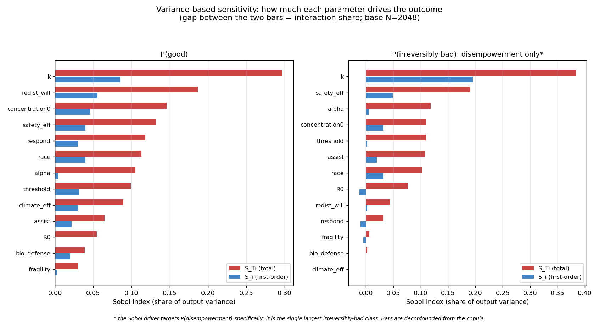
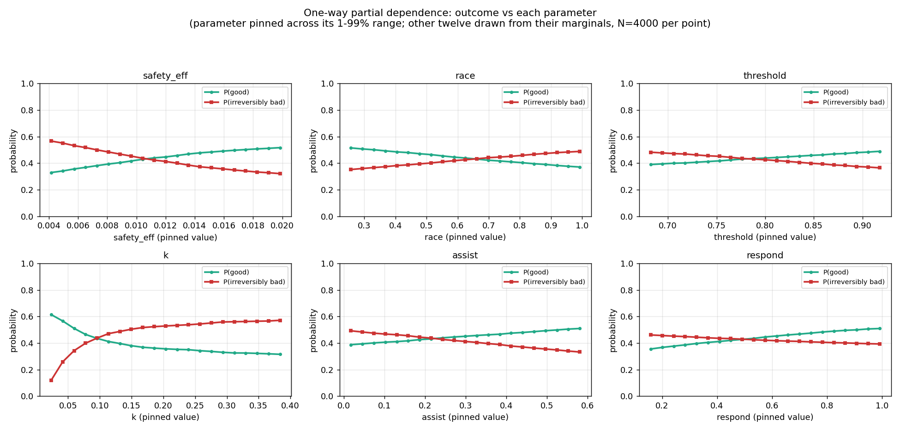
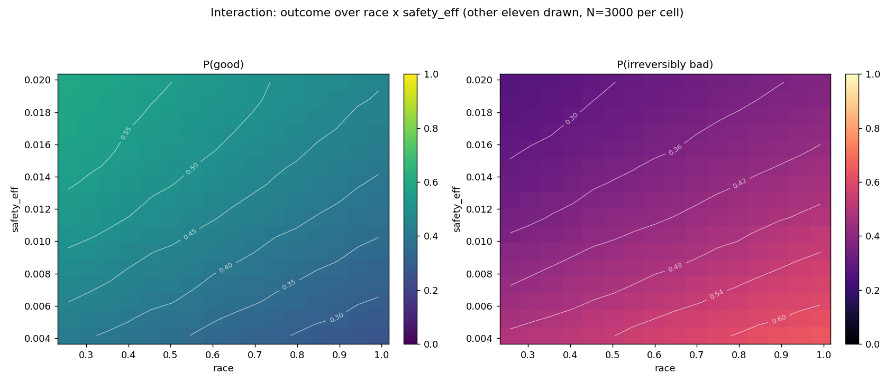

# Reading the sensitivity charts

## The short version

If you only read one section, read this one. Four lessons come out of the three charts below.

Speed is the thing that matters most. How fast AI gets more capable moves the ending more than any other input, for better and for worse. It also acts early, so once a world starts moving quickly the outcome is mostly settled before anyone can catch up.

The choices we can actually make do work. More safety effort, a calmer race, and institutions that react quickly to warning signs all improve how the century ends, and they push in the direction you would hope. None of them is a magic fix by itself, but each one measurably changes the outcome for the better.

Safety effort and a calmer race feed each other. The same amount of safety work buys you far more in a world that is not racing flat out. In a frantic race you have to spend a great deal more just to stand still. Slowing the race and investing in safety are worth more together than either one is on its own.

Most of the other dials barely register. A long tail of inputs hardly changes the ending no matter where you set them. That is good news for anyone deciding where to spend effort, because it says the list of things that genuinely matter is short.

The rest of this page shows where each of those lessons comes from.

The model has a set of input dials: how fast AI gets more capable, how hard the world is racing to build it, how much effort goes into safety, how quickly institutions react to trouble, and so on. A sensitivity analysis asks one plain question about those dials. If you move one of them, how much does the ending change, and which way?

Three charts answer that question in three ways. They live in the `notes/` folder, and you rebuild them any time with `make graphics`.

Throughout, two endings are worth keeping in mind. A "good" ending means the world lands somewhere broadly acceptable. An "irreversibly bad" ending means extinction, civilisational collapse, a permanent authoritarian lock-in, or a quiet loss of human control that never comes back. Everything else is the mixed middle.

## Which dials matter most

Each row is one dial, and they are sorted with the biggest mover at the top. The longer a dial's bars, the more moving it swings the outcome.

There are two bars per dial. The blue bar is the effect the dial has on its own. The red bar is the total effect once you also count the times it works together with other dials. When the red bar is much longer than the blue one, that dial mostly matters in combination with others rather than by itself.

The headline is hard to miss: capability speed, labelled `k`, is the single biggest mover on both the good ending and the bad one. How much safety effort a world puts in, how hard it races, and how responsive its institutions are come next. The dials near the bottom barely change the result whatever you do to them.

## How each dial changes the odds

Six small charts, one per dial. In each one, the dial slides from its low end on the left to its high end on the right, and two lines track what happens. The green line is the chance of a good ending. The red line is the chance of an irreversibly bad one. Where the two lines cross, the odds tip from one side to the other.

Some lines run roughly straight, which means a steady push in one direction. Others bend. Capability speed (`k`) has the sharpest bend of all: once AI starts improving past a certain pace, the green line drops away quickly and then flattens out, so most of the harm is already locked in early. More safety effort and quicker institutional reactions lift the green line. A harder race pulls it down.

This is the chart to reach for when you want the shape of an effect rather than only its size.

## When two dials interact

A colour map of two dials at once: how hard the world is racing runs left to right, and how much safety effort it puts in runs bottom to top. Colour is the chance of an ending. On the left map, greener means a better chance of a good ending. On the right map, warmer means a worse chance of an irreversibly bad one. The white lines are contours, the same idea as a hiking map, joining up the points that share the same odds.

The thing to notice is that the contour lines tilt and curve rather than running flat across. That curve is there because the two dials are tangled together: how much safety effort you need to hold the odds steady depends on how hard the world is racing. In a calm world a little safety effort goes a long way. In a flat-out race you need a great deal more of it just to stay in the same place.

## Building and rebuilding the charts

`make graphics` builds all three at full resolution, which takes about three minutes. `make graphics-quick` produces a rougher version in about thirty seconds if you only want a quick look.

You can point the charts at other dials too:

- `make graphics ARGS="--only pd --pd-params alpha concentration0 redist_will"` sweeps a different set of dials in the middle chart.
- `make graphics ARGS="--only heatmap --heat-x k --heat-y safety_eff"` maps a different pair of dials against each other.

## Two honest caveats

These charts move one or two dials at a time and let the rest vary freely. That is the cleanest way to read a single dial's effect, but the real world moves many dials at once, so read each chart as "all else being equal" rather than as a forecast.

The odds shown here sit close to, but not exactly on, the headline numbers in the main write-up. The charts deliberately switch off the links between dials so each one can be read on its own, and doing that shifts the levels a little. The direction each line points and the shape it makes are what to trust.
